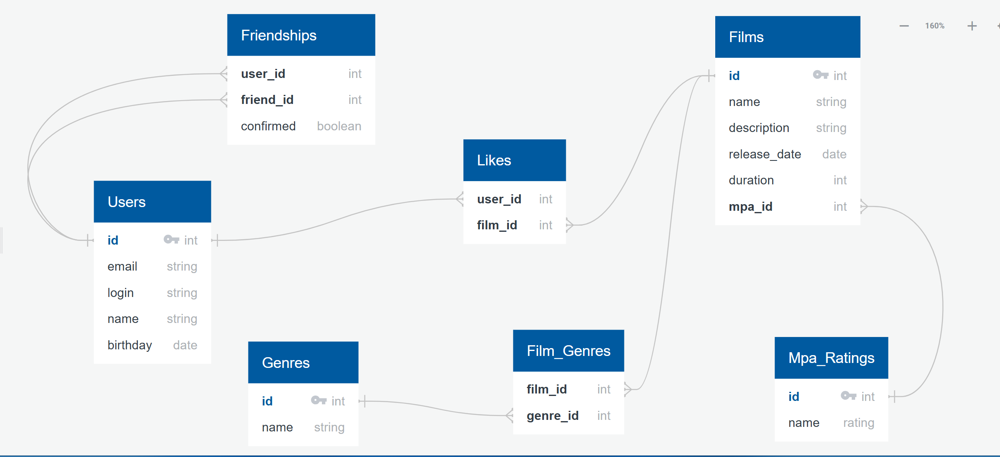

# Filmorate

Filmorate — приложение для рекомендаций фильмов.
Пользователи могут: ставить лайки фильмам, добавлять друзей, также просматривать список популярных фильмов.

## Используется:

- Java 21
- Spring Boot
- Lombok
- In-memory реализация (Map)
- REST API

## Архитектура

- **Controller** — REST-интерфейсы
- **Service** — бизнес-логика
- **Storage** — хранение (временное в памяти)

---

## Модели:

### 1) Пользователи

- Переменные: уникальный `id`, email, логин, имя, дату рождения
- Функции: добавлять других пользователей в друзья
- Дружба требует подтверждения

### 2) Фильмы

- Переменные: уникальный `id`, название, описание, дата релиза, продолжительность, рейтинг MPA
- Содержат множество жанров
- Содержат подмножество лайков множества пользователей
- Содержат множество режиссеров

---

## 🔗 Схема базы данных



### Таблицы:

| Таблица         | Назначение                                        |
|-----------------|---------------------------------------------------|
| `Users`         | Пользователи                                      |
| `Friendships`   | Связь между пользователями с флагом подтверждения |
| `Films`         | Фильмы                                            |
| `Likes`         | Кто лайкнул какой фильм                           |
| `Mpa_Ratings`   | Рейтинги MPA                                      |
| `Genres`        | Жанры                                             |
| `Film_Genres`   | Связь между фильмами и жанрами                    |
| `Reviews`       | Отзывы                                            |
| `Review_likes`  | Табличка лайков к отзывам                         |
| `Directors`     | Режиссёры                                         |
| `Film_Director` | Связь между фильмами и режиссерами                |
| `Feed`          | Лента новостей: пользователь - событие            |

---

## Примеры SQL-запросов

**Топ-10 популярных фильмов:**

```sql
SELECT f.*, COUNT(l.user_id) AS likes
FROM films f
LEFT JOIN likes l ON f.id = l.film_id
GROUP BY f.id
ORDER BY likes DESC
LIMIT 10;
```

**Получение жанров фильма по его ID:**

```sql
SELECT g.*
FROM genres g
JOIN film_genres fg ON g.id = fg.genre_id
WHERE fg.film_id = ?;
```

**Получение списка друзей пользователя:**

```sql
SELECT u.*
FROM users u
JOIN friendships f ON u.id = f.friend_id
WHERE f.user_id = ? AND f.confirmed = true;
```

